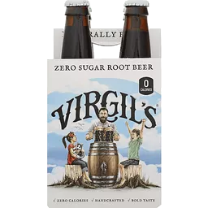

# sode-e-pop

Adds delicious soda pop to factorio :gear:, giving a temporary speed boost.

Excellent quality of life addition for early and mid game, especially in sparse
maps.

## How it works

- Research `sode-e-pop` recipe, so you can craft some delicious root beer
- Build consumable cans of pop using wood, water, and empty barrels
- Drink up to get jacked up, for a minor health boost and a temporary increase in speed
